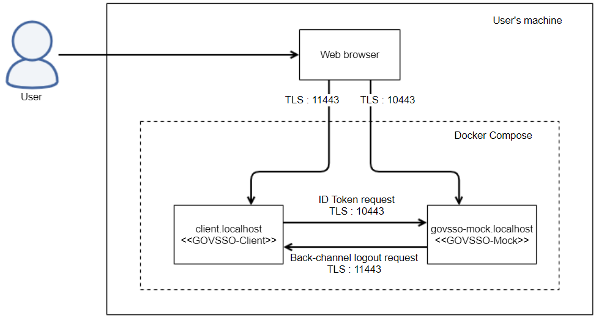

# Deployment

## Prerequisites

1. Default setup requires Docker Engine and Docker Compose to be installed (or Docker Desktop, which also provides
   these). Refer to https://docs.docker.com/engine/install/ and https://docs.docker.com/compose/install/ for further
   instructions.
2. Clone the content of this GovSSO mock repository, either by
   running `git clone https://github.com/e-gov/GOVSSO-Mock.git` (requires Git to be installed) or by
   downloading https://github.com/e-gov/GOVSSO-Mock/archive/refs/heads/master.zip and unpacking it.

## Building

1. Run the following command to build Docker image of mock (replace `C:/path/to/GOVSSO-Mock` part with absolute path of
   the cloned GOVSSO-Mock repository folder in your filesystem); note that Docker Compose command is `docker compose` in
   newer Docker Compose versions and `docker-compose` in older Docker Compose versions:
   ```shell
   docker compose -f C:/path/to/GOVSSO-Mock/docker-compose.yml build
   ```
2. Run the following command to generate keypairs and certificates for mock and example client (replace
   `C:/path/to/GOVSSO-Mock` part with absolute path of the cloned GOVSSO-Mock repository folder in your filesystem;
   MSYS_NO_PATHCONV=1 is only needed when using Git Bash shell on Windows, remove it when using PowerShell, Windows
   command prompt or Linux/Mac; remove --user when using Windows):
   ```shell
   MSYS_NO_PATHCONV=1 docker run --rm --user $(id -u):$(id -g) -v C:/path/to/GOVSSO-Mock/config:/config -w /config eclipse-temurin:17 bash generate-resources.sh
   ```

## Running

Default deployment is provided with Docker Compose, using domain names client.localhost and govsso-mock.localhost



1. Run the following command to run Docker images of mock and example client with Docker Compose (replace
   `C:/path/to/GOVSSO-Mock` part with absolute path of the cloned GOVSSO-Mock repository folder in your filesystem);
   note that Docker Compose command is `docker compose` in newer Docker Compose versions and `docker-compose` in older
   Docker Compose versions:
   ```shell
   docker compose -f C:/path/to/GOVSSO-Mock/docker-compose.yml up
   ```
2. Open https://client.localhost:11443/ to test authentication, session update and logout flows;
   open https://govsso-mock.localhost:10443/ to test back-channel logout request. Refer to [USAGE.md](USAGE.md) for more
   detailed instructions on usage.

## Configuration

* config/config.json – global configuration:
    * host – domain name where mock application is served;
    * serverPort – TCP port where mock application is served;
    * baseHref – HTTP path where mock application is served;
    * tlsCertificate – path to TLS certificate file (in PEM format) for mock application;
    * tlsPrivateKey – path to TLS private key file (in PEM format) for mock application;
    * idTokenSignPrivateKeyPath – path to private key file (in PEM format) that is used for signing ID Token and Logout
      Token;
    * idTokenSignPublicKeyPath – path to public key file (in PEM format) that is served at mock’s JWKS endpoint;
    * idTokenSignKeyId – `kid` value that is served at mock’s JWKS endpoint.
* config/users.json – contains a JSON array of preconfigured users for conveniently selecting on mock authentication
  page; for each user there is a JSON object with the following properties:
    * sub – data that is used as sub-claim value in issued ID Token;
    * given_name – data that is used as given_name claim value in issued ID Token;
    * family_name – data that is used as family_name claim value in issued ID Token;
    * birthdate – data that is used as birthdate claim value in issued ID Token;
    * amr – data that is used as amr claim value in issued ID Token;
    * acr – data that is used as acr claim value in issued ID Token;
    * phone_number - data that is used as phone_number claim value in issued ID Token.
* config/clients.json - contains a JSON array of preconfigured client application for conveniently selecting on mock
  back-channel logout page; for each client application there is a JSON object with the following properties:
    * client_id – data that is used as aud claim value in issued Logout Token;
    * backchannel_logout_uri – client application’s endpoint URL where client application accepts back-channel logout
      requests;
    * redirect_uris - list of client application's redirect URLs where client application accepts authorization
      callbacks;
    * post_logout_redirect_uris - list of client application's redirect URLs where client application accepts logout
      callbacks.
