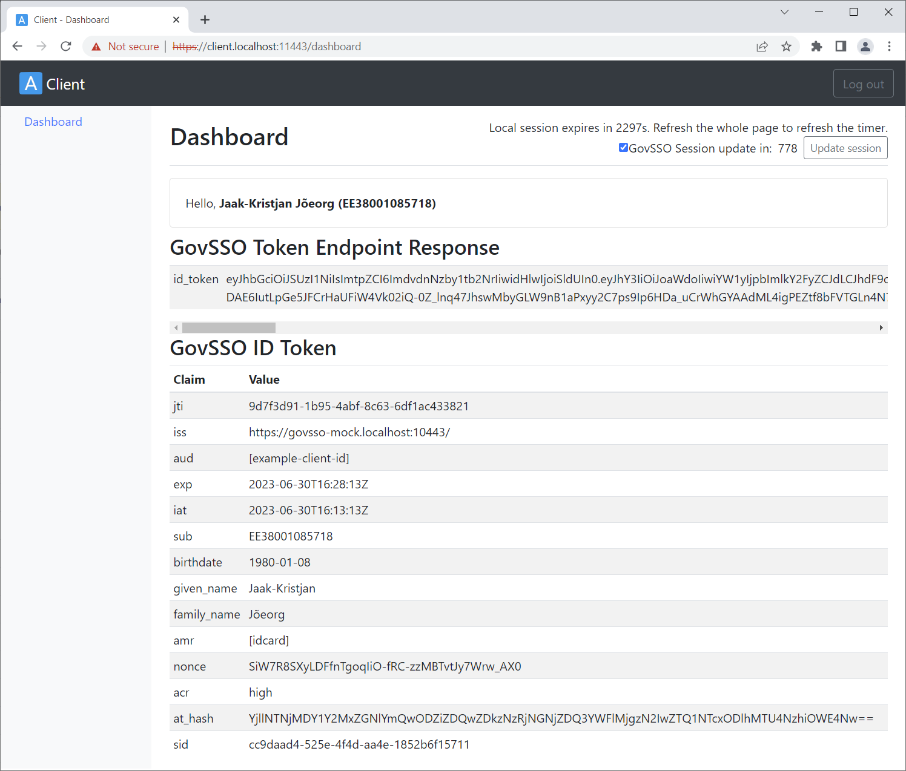

# Usage

GovSSO mock is intended for testing GovSSO protocol integration from client application perspective, not for simulating
real GovSSO service behavior from end-user perspective. Therefore, mock doesn't have similar UI pages compared to real
GovSSO service (session continuation dialog, logout dialog, higher level authentication method warning dialog) and is
implemented with a simplification: sessions are not tracked in user-agent and a new session ID (`sid` claim value in ID
Token) is generated on every authentication (except on session update). According to GovSSO protocol specification,
client application can't tell the difference if a new session was started on GovSSO side, or an existing session was
continued. Therefore, mock doesn't need to differentiate it either. Compared to one client application, using multiple
client applications on the same user-agent with GovSSO mock doesn't add any difference in mock usage flows, therefore
only one GovSSO example client is provided with default mock setup. To enable conveniently testing all flows considering
that mock doesn't track sessions in user-agent, an additional endpoint has been added for initiating back-channel logout
requests.

GovSSO mock implements same 5 endpoints that are listed in GovSSO protocol specification and 1 custom endpoint:

* https://govsso-mock.localhost:10443/.well-known/openid-configuration - server discovery.
* https://govsso-mock.localhost:10443/.well-known/jwks.json - key info.
* https://govsso-mock.localhost:10443/oauth2/auth - authorization.
* https://govsso-mock.localhost:10443/oauth2/token - token.
* https://govsso-mock.localhost:10443/oauth2/sessions/logout - logout.
* https://govsso-mock.localhost:10443/ - additional page for initiating back-channel logout requests.

## 1 Authentication

1. Open https://client.localhost:11443/ , example client displays the following page:

   
2. Click "Log in", example client performs authentication request and mock displays the following page:
    * For issuing an ID Token, mock allows to select from preconfigured user data at the beginning of "Authenticating
      person" tab and/or specify custom user data below it.
    * For information, mock displays authentication request parameter values that are sent by client application on the
      "Authentication request parameters" tab.
    * For validating client application implementation of security checks, issuing different invalid tokens can be done
      on "Modify ID/Logout token claims" tab.

   
3. Click "Authenticate", mock redirects back to example client (to `redirect_uri` URL). Example client performs ID Token
   request to mock, receives ID Token and displays the following page:

   

For completing authentication request automatically in mock, without displaying an UI page, `auto_login` URL parameter can
be added to authentication request. Its value must be personal code (`sub` claim of ID Token) of desired user. For
example https://govsso-mock.localhost:10443/oauth2/auth?response_type=code&client_id=example-client-id&scope=openid&state=12345678&redirect_uri=https://client.localhost:11443/login/oauth2/code/govsso&auto_login=EE37101010021
. If user with specified personal code exists in `users.json`, that user data is used. If user with specified personal
code doesn't exist in `users.json`, that personal code is still used for issuing ID Token, but given name, family name,
and birthdate fields are filled with default data.

## 2 Session update

1. Complete authentication flow as specified in "1 Authentication".

   
2. Click "Update session", example client performs session update request in the background and updates the page
   automatically. Example client now displays new ID Token information (`jti`, `exp`, `iat`, `nonce` should be different, other
   values should be same).

   

## 3 Logout

1. Complete authentication flow as specified in "1 Authentication".

   
2. Click "Log out", example client performs logout request. Mock doesn't display any UI page and redirects back to
   example client (to `post_logout_redirect_uri` URL). If preconfigured client applications configuration file contains a
   client application with matching `client_id`, then mock also performs back-channel logout request (asynchronously) to
   client application in case client application didn't terminate its session before performing logout request. Client
   application displays the following page:

   

## 4 Back-channel logout

1. Complete authentication flow as specified in "1 Authentication". Copy `sid` value for future usage.

   
2. Open https://govsso-mock.localhost:10443/ in another tab or window, mock displays the following page:
    * Mock allows to select from preconfigured client applications on the left side of page and/or specify custom
      back-channel logout request data on the right side of page. By default, only one example client is preconfigured.

   
3. Paste `sid` value copied in first step to "Session ID (sid)" box and click "Back-channel logout". Mock performs
   back-channel logout request to client application (synchronously) and displays a success message:
    * Also, Docker Compose log of example client displays the following log messages indicating that example client
      received and processed the back-channel logout request:
      `Terminating session govsso-sid='ecfaf9be-c14a-4649-8fde-8f60bb3f8bf5', session-id='4A075A47113556FE6F54F1DADDFDC770', sub='EE38001085718'`
    * For easier testing with different client applications, mock doesn't validate TLS certificate of client application
      when performing back-channel logout request.
    * For performing back-channel logout request automatically in mock, without displaying an UI page, the same request
      can be performed with an appropriate tool as browser would perform, for example:
      ```text
      POST https://govsso-mock.localhost:10443/backchannel/sessions/logout HTTP/1.1
      Host: govsso-mock.localhost:10443
      Content-Length: 145
      Content-Type: application/x-www-form-urlencoded

      backchannel_logout_uri=https%3A%2F%2Fclient.localhost%3A11443%2Foauth2%2Fback-channel-logout%2Fgovsso&client_id=example-client-id&session_id=1234
      ```

   
4. Open same tab or window as in first step, where example client was logged in. Refresh page in browser. Client
   application displays the following page:

   
