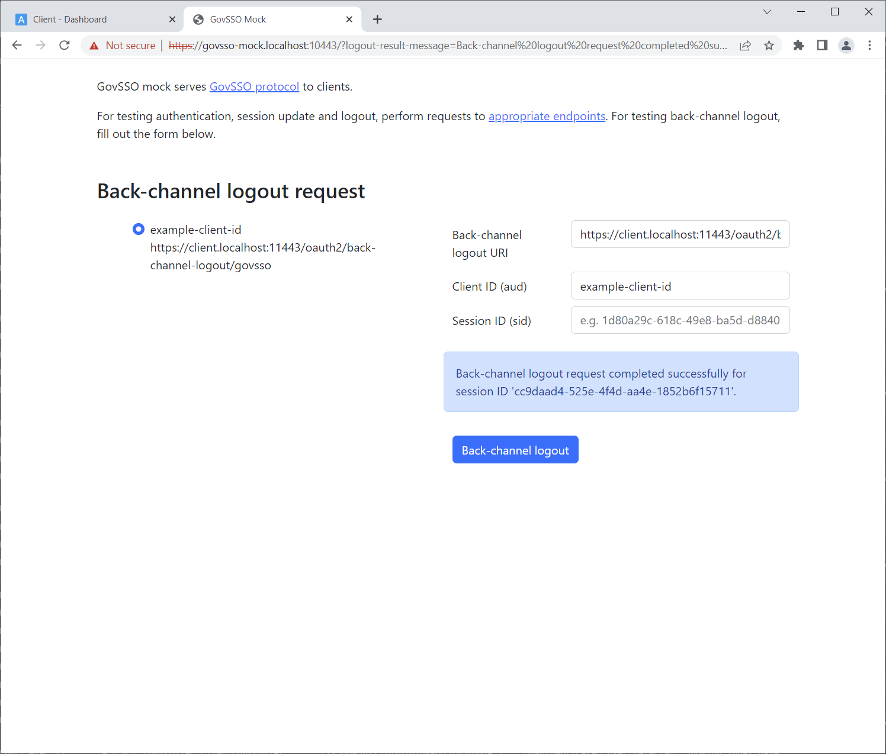

# Usage

GovSSO mock is intended for testing GovSSO protocol integration from a client application perspective, not for
simulating real GovSSO service behavior from an end-user perspective. Therefore, mock doesn't have similar UI pages
compared to real GovSSO service (session continuation dialog, logout dialog, higher level authentication method warning
dialog) and is implemented with a simplification: sessions are not tracked in user-agent and a new session ID (`sid`
claim value in ID Token) is generated on every authentication (except on session update). According to GovSSO protocol
specification, client application can't tell the difference if a new session was started on the GovSSO side, or an
existing session was continued. Therefore, mock doesn't need to differentiate it either. Compared to one client
application, using multiple client applications on the same user-agent with GovSSO mock doesn't add any difference in
mock usage flows, therefore only one GovSSO example client is provided with default mock setup. To enable conveniently
testing all flows considering that mock doesn't track sessions in user-agent, an additional endpoint has been added for
initiating back-channel logout requests.

GovSSO mock implements the same 5 endpoints that are listed in the GovSSO protocol specification and 1 custom endpoint:

* https://govsso-mock.localhost:10443/.well-known/openid-configuration - server discovery.
* https://govsso-mock.localhost:10443/.well-known/jwks.json - key info.
* https://govsso-mock.localhost:10443/oauth2/auth - authorization.
* https://govsso-mock.localhost:10443/oauth2/token - token.
* https://govsso-mock.localhost:10443/oauth2/sessions/logout - logout.
* https://govsso-mock.localhost:10443/ - additional page for initiating back-channel logout requests.

## 1 Authentication

1. Open https://client.localhost:11443/ , example client displays the following page:

   
2. Click "Log in", example client performs an authentication request and mock displays the following page:
    * For issuing an ID Token, mock allows to select from preconfigured user data at the beginning of the
      "Authenticating person" tab and/or specify custom user data below it.
    * For information, mock displays authentication request parameter values that are sent by the client application on
      the "Authentication request parameters" tab.
    * For validating client application implementation of security checks, issuing different invalid tokens can be done
      on the "Modify ID/Logout token claims" tab.

   
3. Click "Authenticate", mock redirects back to the example client (to `redirect_uri` URL). Example client performs an
   ID Token request to mock, receives an ID Token and displays the following page:

   

For completing authentication requests automatically in mock, without displaying an UI page, `auto_login` URL parameter
can be added to an authentication request. Its value must be the personal code (`sub` claim of ID Token) of the desired
user. For example
https://govsso-mock.localhost:10443/oauth2/auth?response_type=code&client_id=example-client-id&scope=openid&state=12345678&redirect_uri=https://client.localhost:11443/login/oauth2/code/govsso&auto_login=EE37101010021
. If a user with the specified personal code exists in `users.json`, that user data is used. If a user with the
specified personal code doesn't exist in `users.json`, that personal code is still used for issuing an ID Token, but the
given name, family name, and birthdate fields are filled with default data.

## 2 Session update

1. Complete the authentication flow as specified in "1 Authentication".

   
2. Click "Update session", example client performs a session update request in the background and updates the page
   automatically. Example client now displays new ID Token information (`jti`, `exp`, `iat`, `nonce` are different,
   other values are the same).

   

## 3 Logout

1. Complete the authentication flow as specified in "1 Authentication".

   
2. Click "Log out", example client performs a logout request. Mock doesn't display any UI page and redirects back to
   the example client (to `post_logout_redirect_uri` URL). If the preconfigured client applications configuration
   file (`clients.json`) contains a client application with a matching `client_id`, then the mock also performs a
   back-channel logout request (asynchronously) to the client application in case client application didn't terminate
   its session before performing the logout request. The client application displays the following page:

   

## 4 Back-channel logout

1. Complete the authentication flow as specified in "1 Authentication". Copy `sid` value for future usage.

   
2. Open https://govsso-mock.localhost:10443/ in another tab or window, mock displays the following page:
    * Mock allows you to select from preconfigured client applications on the left side of the page and/or specify
      custom back-channel logout request data on the right side of the page. By default, only one example client is
      preconfigured.

   
3. Paste the `sid` value copied in the first step to the "Session ID (sid)" box and click "Back-channel logout". Mock
   performs a back-channel logout request to the client application (synchronously) and displays a success message:
    * Also, Docker Compose log of the example client displays the following log messages indicating that the example
      client received and processed the back-channel logout request:
      `Terminating session govsso-sid='ecfaf9be-c14a-4649-8fde-8f60bb3f8bf5', session-id='4A075A47113556FE6F54F1DADDFDC770', sub='EE38001085718'`
    * For easier testing with different client applications, mock doesn't validate TLS certificate of the client
      application when performing back-channel logout requests.
    * For performing a back-channel logout request automatically in mock, without displaying a UI page, the same request
      can be performed with an appropriate tool as the browser would perform, for example:
      ```text
      POST https://govsso-mock.localhost:10443/backchannel/sessions/logout HTTP/1.1
      Host: govsso-mock.localhost:10443
      Content-Length: 145
      Content-Type: application/x-www-form-urlencoded

      backchannel_logout_uri=https%3A%2F%2Fclient.localhost%3A11443%2Foauth2%2Fback-channel-logout%2Fgovsso&client_id=example-client-id&session_id=1234
      ```

   
4. Open the same tab or window as in the first step, where example client was logged in. Refresh the page in the
   browser. The client application displays the following page:

   
